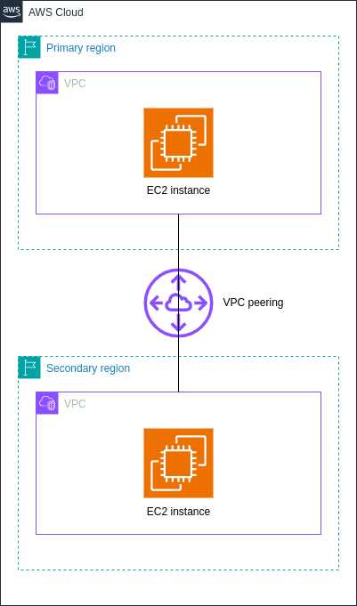

# aws-multi-region-demo

AWS multi-region infrastructure with VPC peering

## Architecture



## Developing

### Dependencies

- [AWS CLI v2](https://docs.aws.amazon.com/cli/latest/userguide/getting-started-install.html) installed and configured with admin access to a valid AWS account
- [OpenTofu](https://opentofu.org/) 1.7.x or later

### Pre-commit hook

A pre-commit hook `hooks/pre-commit` is provided to detect and fix formatting issues prior to committing and pushing your changes.

To use the pre-commit hook, create a symlink `./.git/hooks/pre-commit` pointing to the script:

```bash
ln -s ../../hooks/pre-commit ./.git/hooks/pre-commit
```

### Running the demo

Fork and clone this repository, then navigate to the project root and run:

```bash
tofu init
tofu plan
tofu apply
```

### Supported variables

Refer to the table below for a list of supported OpenTofu variables:

| Name | Type | Required | Default value | Description |
| --- | --- | --- | --- | --- |
| `primary_region` | `string` | - | `"ap-east-1"` | Primary AWS region |
| `secondary_region` | `string` | - | `"ap-southeast-1"` | Secondary AWS region |
| `primary_vpc_cidr` | `string` | - | `"10.1.0.0/16"` | VPC CIDR block for primary AWS region. Must be an [RFC 1918](https://datatracker.ietf.org/doc/html/rfc1918) subnet |
| `secondary_vpc_cidr` | `string` | - | `"10.2.0.0/16"` | VPC CIDR block for secondary AWS region. Must be an [RFC 1918](https://datatracker.ietf.org/doc/html/rfc1918) subnet |
| `primary_subnet_cidr` | `string` | - | `"10.1.1.0/24"` | Subnet CIDR block for primary AWS region. Must be a valid subnet of the primary VPC CIDR block |
| `secondary_subnet_cidr` | `string` | - | `"10.2.1.0/24"` | Subnet CIDR block for secondary AWS region. Must be a valid subnet of the secondary VPC CIDR block |
| `ssh_pubkey_path` | `string` | - | `"~/.ssh/id_rsa.pub"` | Path to your SSH public key. Evaluated with `pathexpand()` before use |
| `instance_type` | `string` | - | `"t3.micro"` | EC2 instance type for both regions |

## License

[Apache 2.0](./LICENSE)
